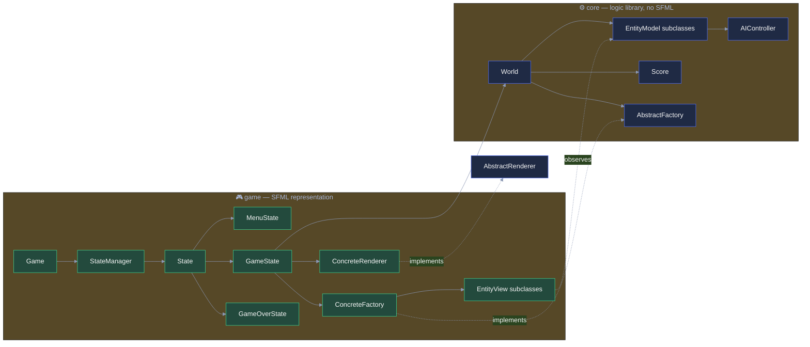

# Bomberman

**Author:** Kyan Van den Eynde
**Student number:** s0242566
**Repository:** https://github.com/kyanvde/bomberman

Advanced Programming project (2025-2026, University of Antwerp): an interactive game inspired by the classic
Bomberman battle mode, written in C++ using SFML.

Bomberman is a game in which the Player competes against three computer-controlled characters to be the last man
standing. They do this by using bombs to break blocks, gather power-ups and trap the other players!

## Project layout

- `core/` — the game logic library (static, no SFML dependency). Entities, world simulation, collision detection,
  and the design-pattern abstractions (Observer, Abstract Factory, Singleton) all live here.
- `game/` — the SFML-based representation layer: the window/main loop, states (menu, gameplay), and the concrete
  views/renderer/factory that bring `core`'s entities to the screen.
- `tests/` — a small, dependency-free test suite (`core_tests`) exercising `core` in isolation, run via CTest.
- `assets/` — sprites, fonts, and world layout files used by the game.

## Design & architecture

The project is split into two CMake targets, mirroring the required logic/representation separation: `core` (a
static library with zero SFML dependency — CI builds it standalone to prove this) holds all game *logic* — entities,
world simulation, collision, scoring, AI, persistence — using only normalized `[-1, 1]` `Vector2` positions, never
pixels. `game` is the SFML *representation*: the window/main loop, input handling, views, and the concrete
factory/renderer that instantiate `core`'s abstractions. `game` depends on `core`; `core` has no idea `game` exists.



**Required classes:** `Game` owns the window/main loop and forwards to whichever `State` is active — no game logic
of its own. `Stopwatch` and `Random` are `std::chrono`/`std::mt19937`-based Meyers' singletons (no `sf::Clock`, no
legacy `rand`/`srand`, no busy-waiting). `World` is the Entity Controller — entity creation/removal, collision, bomb
detonation, outcome. `Camera` does pure-arithmetic `[-1,1]` → pixel projection, scaling both axes uniformly and
letterboxing so the result is never resolution- or aspect-ratio-dependent. `Score` is an `Observer` reacting to
`GameEvent`s fired by `World`, plus an explicit `tick(deltaTime)` for time-alive, and it persists the top-5 list to
a file.

**Design patterns:**

- **MVC** — `World` is the Entity Controller; each `EntityModel` subclass is a pure-data/logic Model; each matching
  `EntityView` (`game/views/*.h`) is the View, refreshed purely by observing its model.
- **Observer**, for both required purposes on the same channel: `EntityView`s re-sync position/animation on every
  `notify()`, and the same `GameEvent` (a `GameEventType` plus the responsible `CharacterColor`) also reaches `Score`
  — attached to every entity by `World::addEntity` — for event-driven scoring, with no polling anywhere.
- **Abstract Factory** — `World` only ever holds an `AbstractFactory` interface; `ConcreteFactory` attaches the
  correct `EntityView` inside each `create*()` call, so `World` never touches representation code.
- **Singleton** — `Stopwatch` and `Random`, as required.
- **State** — the assignment's own description of `Game` delegates responsibility to "the StateManager or concrete
  States"; `MenuState`/`GameState`/`GameOverState` are pushed/popped on a `StateManager` stack instead of a
  hand-rolled enum + switch in `Game::update()`.
- **Strategy** (bonus) — `Character` holds an optional `AIController`; `BasicAIController::decide()` returns a
  `Decision` applied through the exact same `World::moveCharacter`/`placeBomb` the human player's input uses, so bot
  and player movement share one code path.
- **Double dispatch** (bonus) — collision resolution needs to know both the mover's and the obstacle's concrete
  type without `dynamic_cast`. `obstacle.blocksMovementOf(mover, ...)` calls back into `mover.isBlockedBy(obstacle,
  ...)`, which (for a `Character`) calls back again into `obstacle.blocksCharacterMovement(character, ...)` — each
  hop a virtual call, so the final overload resolved depends on both objects' real types. This is the same
  technique the assignment's own bonus section points at when it suggests a Visitor for resolving generic
  `EntityModel`s to their concrete type.

A few decisions worth calling out: cross-entity questions (*"does this block an explosion?", "is this a bomb to
chain-detonate?"*) are answered by small default-`false` predicate virtuals on `EntityModel` rather than
`dynamic_cast` (there are zero casts anywhere in the codebase); entities are identified by a stable `EntityId`
rather than vector position, since removal (destroyed walls, expired bombs/explosions, dead characters) would
otherwise invalidate indices; removal itself is deferred to the end of each tick to survive mid-tick mutation (a
bomb's explosion can itself create/destroy entities while `World::update` is still iterating); and AI pathfinding
runs over a single per-tick `TileGrid` snapshot instead of querying `World` per tile, both for performance and so a
search can never accidentally mutate the world it's reasoning about.

## Bonus features

- **Per-bot personalities** — the three AI-controlled characters share one `BasicAIController` implementation but
  are tuned differently (aggression radius, power-up search radius) via constructor parameters, so they behave
  noticeably differently without any duplicated decision logic.
- **Two additional design patterns** beyond the required set — **Strategy** for AI decision-making, and **double
  dispatch** for type-safe collision resolution without `dynamic_cast` — each adopted because it was the natural
  fit for a real design problem.

## Building

Requires CMake 3.28+ and a C++17 compiler (developed against G++ 13.2.0 / Clang 18.0.0 on Ubuntu 24.04.3, the
reference grading platform; also builds on MSVC). SFML 2.6.1 is fetched automatically via CMake's `FetchContent` —
no manual SFML installation is required.

```bash
cmake -S . -B build
cmake --build build
```

The `bomberman` executable is produced under `build/game/` (or `build/game/<Config>/` with a multi-config
generator, e.g. Visual Studio), alongside a copy of the `assets/` directory and the required SFML shared libraries.

## Running

```bash
./build/game/bomberman
```

## Testing

```bash
ctest --test-dir build --output-on-failure
```

224 checks currently cover core math (`Vector2`, `Camera`'s projection), `Random`'s distribution/bounds,
`WorldLoader` parsing and its exception paths, movement/collision edge cases, bomb fuse/arming/chain-reaction
behavior, power-up spawn/pickup, `Score`'s event-driven point deltas, `HighScores` file round-tripping, and AI
decision-making against scripted, seeded arenas.

## Continuous Integration

Every push is built (and tested) on CircleCI against an Ubuntu 24.04 image matching the reference platform; see
`.circleci/config.yml`.
