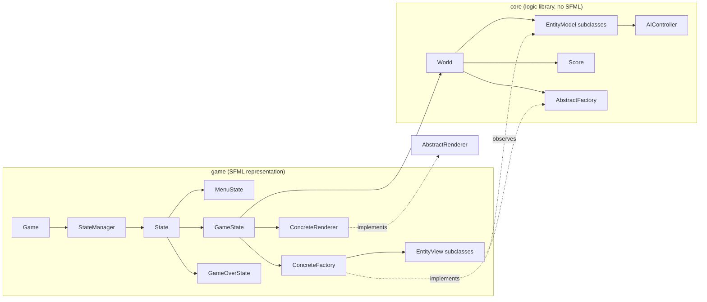
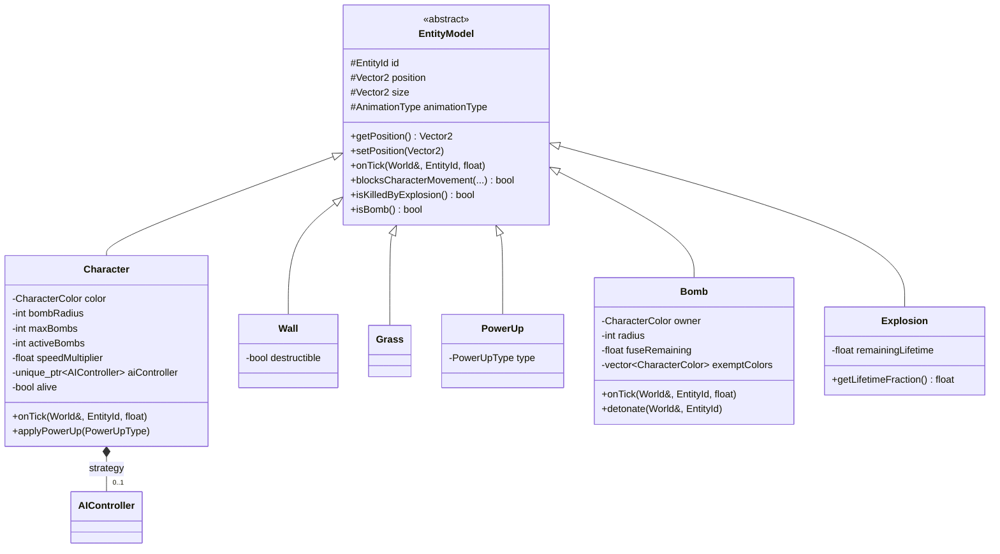
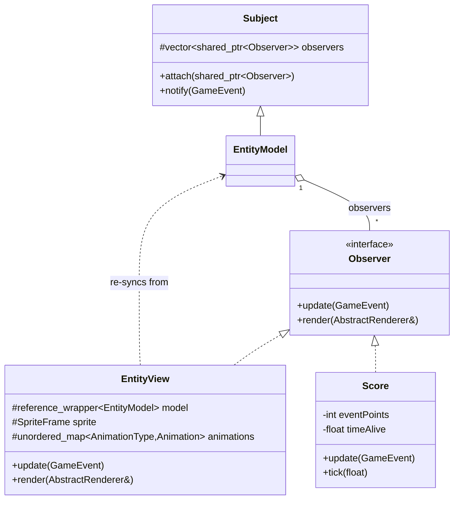
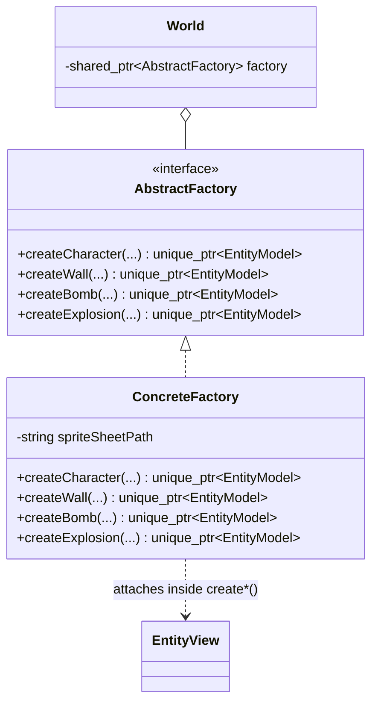

# Design Report

Bomberman — Advanced Programming project, Kyan Van den Eynde (s0242566)

This document covers the architecture and design decisions behind the implementation. It
deliberately does not restate the gameplay rules from the assignment itself — see the
[README](../README.md) for build/run instructions, and `assets/assignment.pdf` for the original
brief. Doxygen-generated API documentation (every public member is commented) lives under
`docs/html/`; this report covers the *why*, not the per-method *what*.

## 1. Architecture overview

The project is split into two CMake targets, mirroring the assignment's required logic/representation
separation:

- **`core`** (static library, zero SFML dependency — verified by CI building it as a standalone
  target with no SFML headers reachable) — all game *logic*: entities, world simulation, collision
  detection, scoring, AI, persistence. Every position in `core` is a `Vector2` in the normalized
  `[-1, 1]` coordinate space described in the assignment, never a pixel.
- **`game`** — the SFML *representation*: the window/main loop, input handling, views, and the
  concrete factory/renderer that instantiate `core`'s abstractions. `game` depends on `core`;
  `core` has no idea `game` exists.



`core` never references `sf::*` types anywhere, and `core/CMakeLists.txt` links no SFML target —
so the logic library genuinely compiles and links without SFML installed, not just "in principle."

## 2. Required classes

| Class | Where | Notes |
|---|---|---|
| `Game` | [`game/Game.h`](../game/Game.h) | Owns the window and `StateManager`; `run()` is the main loop (`processEvents → update → render`). No game logic — it forwards to whichever `State` is active. |
| `Stopwatch` | [`core/Stopwatch.h`](../core/Stopwatch.h) | `std::chrono::high_resolution_clock`-based, Meyers' singleton. `tick()` computes `deltaTime`; no `sf::Clock` anywhere, no busy-wait. |
| `World` | [`core/World.h`](../core/World.h) | Owns all entities (`std::vector<std::unique_ptr<EntityModel>>`), the Entity Controller in MVC terms — creation/removal, collision, bomb detonation, outcome. |
| `Camera` | [`core/Camera.h`](../core/Camera.h) | Pure arithmetic projection from `[-1, 1]` world space to pixel space (`projectPosition`/`projectSize`), scaling both axes uniformly and letterboxing so the projection is never resolution- or aspect-ratio-dependent; no SFML types touched. |
| `Score` | [`core/Score.h`](../core/Score.h) | An `Observer`; reacts to `GameEvent`s fired by `World`. Time-alive is driven explicitly via `Score::tick(deltaTime)` from `GameState`, using `Stopwatch`'s delta — see §4.3. |
| `Random` | [`core/Random.h`](../core/Random.h) | `std::mt19937` stored as a data member (not reconstructed per call), Meyers' singleton, seeded once from `std::random_device`. `chance(probability)` and `setSeed()` (test-only reproducibility) build on top of it. |

## 3. Design patterns

### 3.1 Model–View–Controller

`World` is the Entity Controller: it owns every `EntityModel` (the Model half) and orchestrates
their interactions. Each `EntityModel` subclass (`Character`, `Wall`, `Grass`, `PowerUp`, `Bomb`,
`Explosion`) holds only data and logic about itself — no rendering code, no SFML. The matching
`EntityView` subclass (`game/views/*.h`) holds only *how it looks*, refreshed by observing its
model.



`Wall`/`Character`/`Bomb`/`PowerUp`/`Explosion` never need `dynamic_cast` against each other —
see §4.1 for how cross-entity questions ("does this block an explosion?", "is this a bomb I should
chain-detonate?") are answered polymorphically instead.

### 3.2 Observer — for both required purposes

`Subject`/`Observer` is used exactly as the assignment describes, for two independent purposes on
the same channel:



1. **View synchronization.** `EntityModel::setPosition`/`setAnimationType` call `notify()`; every
   attached `EntityView` re-reads position, size, and the active `AnimationType` (driving which
   walk/death/tick animation frame to show), then draws itself via `AbstractRenderer`.
2. **Scoring.** The exact same `notify()` call also reaches `Score`, attached to *every* entity by
   `World::addEntity`. `GameEvent` (see below) carries a `GameEventType` and the responsible
   `CharacterColor`, so `Score::update` can filter to Player-attributed events and apply the right
   point delta — without `Score` polling anything.

```cpp
enum class GameEventType { Tick, BlockDestroyed, PowerUpCollected, EntityKilled, GameWon, GameLost };
struct GameEvent { GameEventType type = GameEventType::Tick; CharacterColor actor = CharacterColor::White; };
```

Defaulting `GameEvent` to a routine `Tick` means every pre-existing `notify()`/`update()` call site
(position/animation changes, unrelated to scoring) keeps compiling and behaving unchanged — `Score`
simply ignores `Tick`.

### 3.3 Abstract Factory

`World` only ever holds a `std::shared_ptr<AbstractFactory>` — the abstract interface — and calls
`factory->createCharacter(...)`, `factory->createBomb(...)`, etc. It has no idea `ConcreteFactory`
or any SFML view type exists. `game::ConcreteFactory` implements each `create*` method and attaches
the matching `EntityView` subclass to the model *inside* the factory method itself, so `World`
produces fully-wired entities without ever touching representation code:



`Game`/`GameState` construct the one `ConcreteFactory` and hand it to `World`'s constructor as an
`AbstractFactory`, exactly as specified.

### 3.4 Singleton

`Stopwatch` and `Random` (§2) both use the classic Meyers' singleton: private constructor, deleted
copy/move, `static X& getInstance()` returning a function-local `static` instance. Neither is
reseeded/reconstructed per call — `Random` in particular keeps its `std::mt19937` as a member so
successive draws come from the same generator state, as required.

### 3.5 Additional patterns (beyond the required set)

Two more patterns show up because they were the natural fit for problems the design ran into —
not added purely to check a bonus box:

- **State** (`game/State.h`, `StateManager.h`): `MenuState` → `GameState` → `GameOverState` →
  `MenuState` transitions are modeled as a stack of `State` objects pushed/popped by
  `StateManager`, each handling its own `processEvent`/`update`/`render`. This replaces what would
  otherwise be a hand-rolled enum + switch statement scattered through `Game::update()`.
- **Strategy** (`core/AIController.h`): `Character` holds a `std::unique_ptr<AIController>`
  (`nullptr` for the human-controlled White character). `BasicAIController::decide(world, self)`
  is a pure function from world-state to a `Decision{direction, placeBomb}` — `Character::onTick`
  applies that decision through the exact same `World::moveCharacter`/`World::placeBomb` the human
  player's keyboard input goes through, so bot and player movement share one code path with zero
  duplication.

## 4. Notable design decisions

### 4.1 No `dynamic_cast`: predicate virtuals instead of downcasting

Cross-entity questions ("does this block an explosion?", "should this die here?", "is this a bomb
I should chain-detonate?") are answered by small, cheaply-overridden `noexcept` virtuals on
`EntityModel` — `blocksExplosion()`, `isDestructibleByExplosion()`, `isKilledByExplosion()`,
`isBomb()`, `isPowerUp()`, `isGrass()`, `getCharacterColor()`, `getPowerUpType()` — each defaulting
to the "no" answer and overridden only where it matters (e.g. only `Wall` overrides
`blocksExplosion()`). `World::explodeTile` and `detonateBomb` walk the entity list and ask these
questions without ever downcasting a generic `EntityModel*` to a concrete type. This keeps
`core/World.cpp`'s explosion logic entirely type-agnostic and is the reason a grep for
`dynamic_cast` across the whole codebase returns nothing.

### 4.2 Stable entity IDs, not vector position

Early on, `World` identified entities purely by their index in `entities` — untenable once entities
can be removed mid-game (a destroyed wall, an expired bomb, an expired explosion tile). Every
`EntityModel` now carries an `EntityId` (a `std::size_t`), assigned once by `World::addEntity` and
never reused or renumbered. All public `World` APIs (`moveCharacter`, `placeBomb`,
`markForRemoval`, ...) take an `EntityId`, resolved to a current vector index internally via
`indexOf()` only where needed.

### 4.3 Deferred removal, to survive mid-tick mutation

`World::update(deltaTime)` calls `EntityModel::onTick` on every entity present at the *start* of
the tick. A bomb's `onTick` can trigger `detonateBomb`, which can create `Explosion` entities,
destroy walls, kill characters, and chain-detonate other bombs — all while the outer loop is still
iterating. Mutating `entities` (a `std::vector`) mid-iteration would invalidate iterators and risk
undefined behavior. Instead, anything that "goes away" this tick is only `markForRemoval`'d;
`flushPendingRemovals()` runs once, after the tick's iteration is fully done. `isPendingRemoval()`
doubles as the chain-reaction reentrancy guard — a bomb caught twice in the same cascade (two
overlapping blasts reaching it) is not detonated twice.

### 4.4 Normalized `[-1, 1]` world space, projected by `Camera`

Every entity's `position`/`size` lives in the assignment-mandated `[-1, 1]` normalized space,
established once in `WorldLoader` from the world file's grid dimensions
(`cellSize = 2 / worldSize`). `core::Camera::projectPosition`/`projectSize` are the only place this
gets converted to pixels, via plain arithmetic — no `sf::View`, no SFML transform utilities. This
means `core` genuinely has no notion of window resolution, and collision/AI/scoring logic is
identical regardless of what size window the player picks.

The world is always a square `[-1, 1] x [-1, 1]` region, but the window it's drawn into is whatever
aspect ratio the player resizes it to. Scaling each axis independently to fill that rectangle (an
earlier version of `Camera` did exactly this) stretches every sprite by a different amount
depending on the window's current width-to-height ratio — the resolution-dependent look the
normalized coordinate system is meant to prevent in the first place, just moved one layer up into
the projection step instead of the world model. `Camera` now scales both axes by the same factor
(the viewport's smaller dimension) and centers the result in the larger one, leaving even
letterbox/pillarbox bars rather than distorting anything; `CameraTests.cpp` checks this explicitly
against a non-square viewport.

### 4.5 Tile-grid snapshot for AI pathfinding

Early AI logic queried `World` per-tile per-decision, which is quadratic in the number of entities
and awkward to reason about (floating-point boundary comparisons for "is this tile blocked").
`World::buildTileGrid()` now takes a single pass over `entities` and produces an immutable
`TileGrid` snapshot — per-tile bitsets for walls/destructible walls/bombs/power-ups/danger, plus
where every living character stands (`core/TileGrid.h`). `BasicAIController::decide()` runs a
breadth-first search directly over this snapshot: cheap, side-effect-free (it can never accidentally
mutate the world it's reasoning about), and lets each `GridCoord` carry whole-tile semantics instead
of epsilon-compared floats.

### 4.6 Bomb arming and bystander exemption

A freshly-placed bomb doesn't block its owner immediately (otherwise the owner could never step
off the tile they just bombed) — `Bomb::exemptColors` starts as `{owner}` and a color is dropped
from it, permanently, the moment that character leaves the bomb's tile. This was later generalized:
since characters don't block each other's movement, an enemy can walk onto another character's tile
and drop a bomb there. Without a fix, whoever it landed on would have no grace period and be
trapped in place until detonation. `Bomb::onTick` now scans its own tile once, on its first tick,
for any other character standing there, and grants them the same exemption — mirroring the owner's
rule rather than introducing a second mechanism.

### 4.7 Continuous movement without wall-sticking

Naively resolving movement as "take the full step or none of it" leaves a character stranded up to
a full frame's travel short of any obstacle — since characters are exactly one tile wide, that gap
is enough to leave them straddling two tiles, unable to turn. `World::resolveAxisStep` instead
bisection-searches for the largest fraction of the requested step that stays collision-free, so a
character always ends up flush against whatever it's walking into. A small "corner-assist" nudge
(`cornerAssistPosition`) then handles the case where a character is a hair off-grid and a
perpendicular turn would otherwise be rejected by a neighbouring tile it isn't really trying to
enter.

## 5. Testing approach

`tests/` builds a single dependency-free `core_tests` binary linked only against `core` (itself a
build-time proof of the SFML-free requirement), run via `ctest`. No framework is used — per the
assignment's own note that unit-testing frameworks haven't been covered yet — just a small
`TestRunner::check(condition, description)` helper. 222 checks currently pass, covering (among
others): `Vector2`/`Camera` math, `Random` distribution and `chance()` bounds, `WorldLoader` parsing
and its exception paths, movement/collision edge cases, bomb fuse/arming/chain-reaction/reentrancy,
wall destructibility, power-up spawn/pickup and permanence, `Score` event-driven point deltas,
`HighScores` file round-tripping (including a missing/corrupt file), and AI decision-making against
scripted, seeded arenas (`Random::setSeed()` exists specifically so these are reproducible rather
than flaky). `.circleci/config.yml` runs the same `ctest` pass on an `ubuntu:24.04` image matching
the reference grading platform, on every push.

## 6. Known limitations

Being upfront about what's incomplete, rather than letting it surface during the defense:

- **Death animation is a placeholder.** `CharacterView` currently uses a single static, arbitrary
  spritesheet cell per color rather than a dedicated death sprite/animation — it triggers on the
  right event, at the right time, per the right character, but visually it's a stub pending a
  proper sprite.
- **AI escape distance is capped at a fixed search depth** (`bombEscapeSearchDepth = 4` tiles in
  `BasicAIController.cpp`) regardless of the bot's actual bomb radius. The danger-zone check itself
  does scale correctly with radius (`TileGrid::blastReaches`), so a bot never walks into a blast it
  shouldn't — but a bot with a large enough radius may, in rare cases, simply decline to place a
  bomb rather than genuinely retreating further than 4 tiles to stay safe.
- **No victory animation** — explicitly marked optional in the assignment; `GameOverState` shows
  static win/lose text instead.
